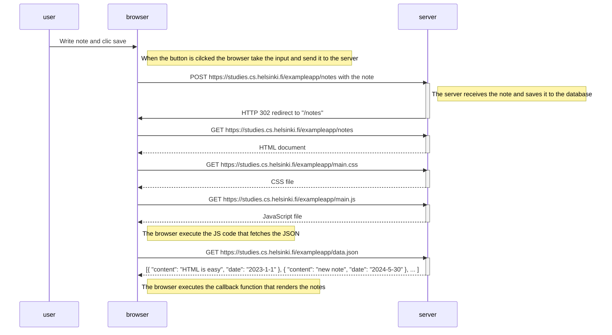
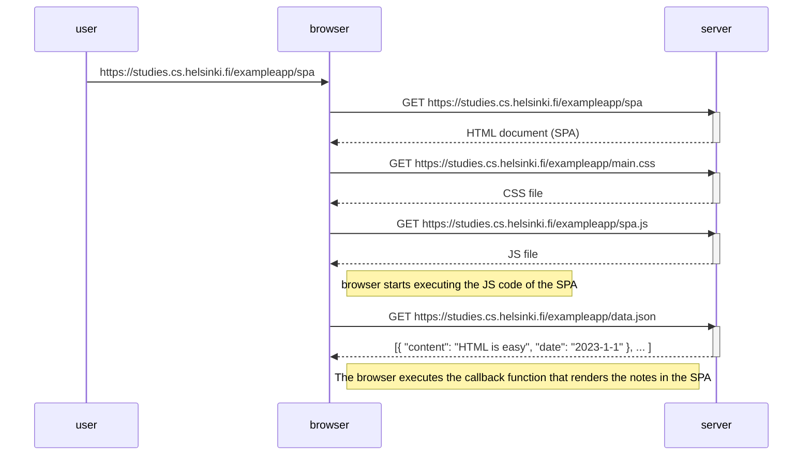
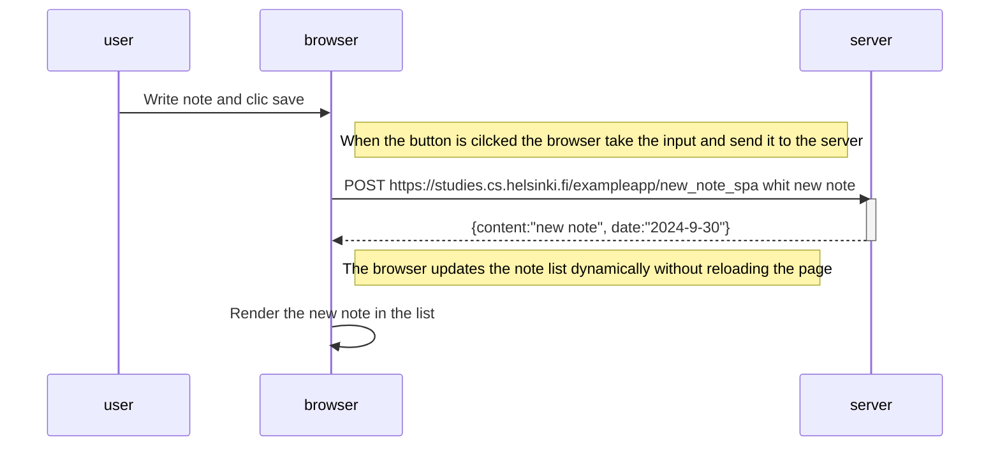

```mermaid
sequenceDiagram
    participant user
    participant browser
    participant server

    user->>browser: Write note and clic save
    Note right of browser: When the button is cilcked the browser take the input and send it to the server

    browser->>server: POST https://studies.cs.helsinki.fi/exampleapp/notes with the note
    activate server
    Note right of server: The server receives the note and saves it to the database
    server->> browser: HTTP 302 redirect to "/notes"
    deactivate server

    browser->>server: GET https://studies.cs.helsinki.fi/exampleapp/notes
    activate server
    server-->>browser: HTML document
    deactivate server

    browser->>server: GET https://studies.cs.helsinki.fi/exampleapp/main.css
    activate server
    server-->>browser: CSS file
    deactivate server

    browser->>server: GET https://studies.cs.helsinki.fi/exampleapp/main.js
    activate server
    server-->>browser: JavaScript file
    deactivate server

    Note right of browser: The browser execute the JS code that fetches the JSON

    browser->>server: GET https://studies.cs.helsinki.fi/exampleapp/data.json
    activate server
    server-->>browser: [{ "content": "HTML is easy", "date": "2023-1-1" }, { "content": "new note", "date": "2024-5-30" }, ... ]
    deactivate server

    Note right of browser: The browser executes the callback function that renders the notes
```

```mermaid
sequenceDiagram
    participant user
    participant browser
    participant server

    user->>browser: https://studies.cs.helsinki.fi/exampleapp/spa
    browser->>server: GET https://studies.cs.helsinki.fi/exampleapp/spa
    activate server
    server-->>browser: HTML document (SPA)
    deactivate server

    browser->>server: GET https://studies.cs.helsinki.fi/exampleapp/main.css
    activate server
    server-->>browser: CSS file
    deactivate server

    browser->>server: GET https://studies.cs.helsinki.fi/exampleapp/spa.js
    activate server
    server-->>browser: JS file
    deactivate server

    Note right of browser: browser starts executing the JS code of the SPA

    browser->>server: GET https://studies.cs.helsinki.fi/exampleapp/data.json
    activate server
    server-->>browser: [{ "content": "HTML is easy", "date": "2023-1-1" }, ... ]
    deactivate server

    Note right of browser: The browser executes the callback function that renders the notes in the SPA
```

```mermaid
sequenceDiagram
    participant user
    participant browser
    participant server

    user->>browser: Write note and clic save
    Note right of browser: When the button is cilcked the browser take the input and send it to the server

    browser->>server: POST https://studies.cs.helsinki.fi/exampleapp/new_note_spa whit new note
    activate server
    server-->>browser: {content:"new note", date:"2024-9-30"}
    deactivate server

    Note right of browser: The browser updates the note list dynamically without reloading the page
    browser->>browser: Render the new note in the list
```